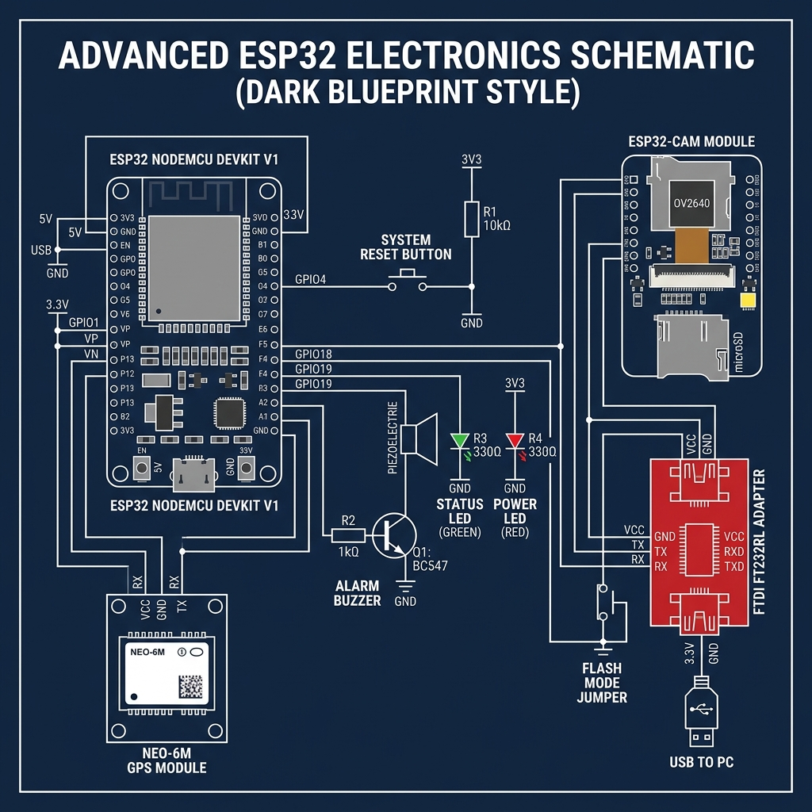
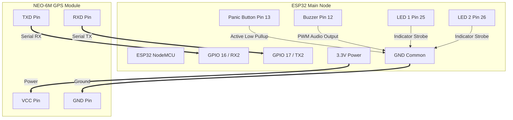
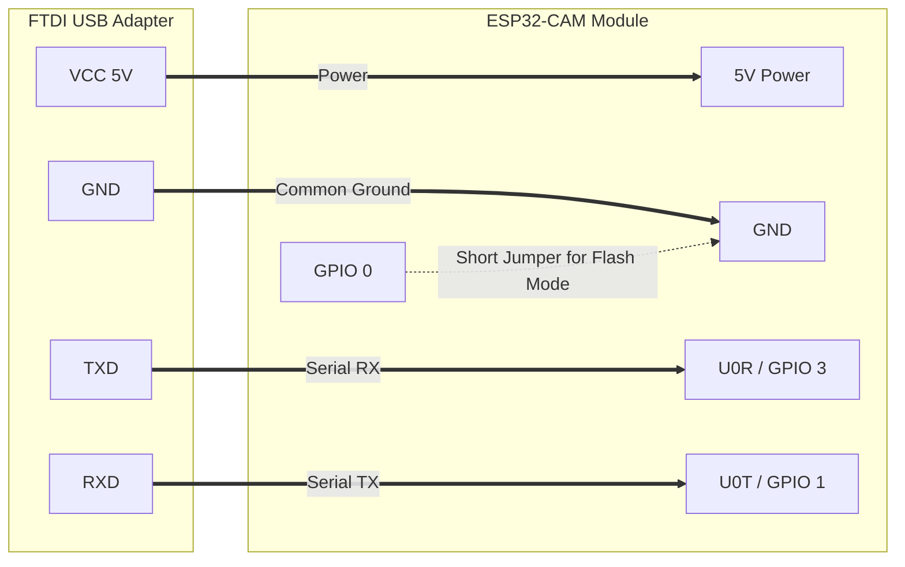

# CrimeShield — Smart Emergency Response System

An integrated, enterprise-grade IoT security solution that coordinates hardware triggers, sensor readouts, real-time GPS tracking, and dual-camera video feeds. When an emergency is triggered, the system sounds sirens, flashes strobe lights, captures high-resolution evidence snapshots, and automatically backs up data and video recordings to Supabase and Google Drive.

---

## 🚀 Key Features

* **Dual-Camera Live Streaming:** Real-time MJPEG video feeds from ESP32-CAM modules directly on the dashboard.
* **Hardware Resolution Controls:** Select between VGA, SVGA, HD (XGA), or UXGA streams directly from the dashboard, dynamically reconfiguring the camera sensors over the network.
* **Automated Voice Calls & SMS Alert:** Triggers outbound phone calls to emergency services using Twilio and sends a text message with a Google Maps location link.
* **Automatic Call Teardown:** Webhook integrations with Twilio and Socket.IO to close the dashboard overlay and clear warning lights automatically when the responder hangs up.
* **Real-Time GPS Tracking:** Displays live coordinates and satellite telemetry on an interactive OpenStreetMap tracking card.
* **Database GPS Fallback:** If the physical GPS module goes offline, the dashboard automatically falls back to showing the last-saved coordinates fetched from the database.
* **Passwordless Operations:** Clean, simplified backend authentication routes that automatically authorize dashboard operations on local and production environments.
* **Cloud Backup & Evidence Logging:** Automatically logs emergency events, GPS data, snapshots, and video recordings to a Supabase database, and uploads media files to Google Drive.

---

## 📂 Repository Structure

```text
├── Backend/                # Outbound Calling, SMS & Registry Server
│   ├── server.js           # Express + Socket.IO + Twilio Integration
│   ├── package.json        
│   └── .env                # Twilio, Supabase & Port configurations
│
├── Camera/               # ESP32-CAM Firmware
│   └── CameraWebServer/    
│       ├── CameraWebServer.ino   # Camera sketch (HTTPS/CORS enabled)
│       └── app_httpd.cpp         # Camera web server endpoints
│
├── ESP32/                  # ESP32 Main Controller Firmware
│   └── ESP32.ino           # Siren, Buzzer, Button & GPS serial parsing
│
├── Website/                # React Dashboard Frontend (Vite + React)
│   ├── src/                # React components, styles, & hooks
│   ├── public/             # Static assets
│   ├── package.json        
│   └── vite.config.ts      
│
└── README.md               # Project documentation
```

---

## ⚙️ Configuration & Environment Variables

### 1. Web Dashboard (`Website/.env`)
Create a `.env` file inside the `Website` directory:

```env
VITE_SUPABASE_URL=https://your-project.supabase.co
VITE_SUPABASE_ANON_KEY=your-supabase-anon-key
VITE_BACKEND_URL=http://localhost:5001
```

*Note: Device IP addresses are saved locally in your browser's settings modal (the gear icon on the dashboard) and will override environment defaults.*

### 2. Calling & SMS Backend (`Backend/.env`)
Create a `.env` file inside the `Backend` directory:

```env
PORT=5001
SUPABASE_URL=https://your-project.supabase.co
SUPABASE_KEY=your-supabase-service-role-key
TWILIO_ACCOUNT_SID=your-twilio-account-sid
TWILIO_AUTH_TOKEN=your-twilio-auth-token
TWILIO_PHONE_NUMBER=your-twilio-phone-number
EMERGENCY_CONTACT=your-recipient-phone-number
PUBLIC_URL=https://your-subdomain.ngrok-free.app
```

---

## 🛠️ Local Installation & Running

### 1. Run the Backend
Navigate to the `Backend` directory, install dependencies, and start the development server:

```bash
cd Backend
npm install
npm run dev
```
The server will boot on port `5001`.

### 2. Run the Frontend
In a new terminal window, navigate to the `Website` directory, install dependencies, and start the Vite development server:

```bash
cd Website
npm install
npm run dev
```
The dashboard will open on `http://localhost:5173`. Open this URL, click the gear icon in the header, and ensure the **Backend URL** is set to `http://localhost:5001`.

---

## 💾 Supabase Database Setup

To store emergency logs and coordinates, run the following SQL command in your **Supabase SQL Editor**:

```sql
CREATE TABLE IF NOT EXISTS public.events (
    id bigint GENERATED BY DEFAULT AS IDENTITY,
    created_at timestamp with time zone DEFAULT now() NOT NULL,
    event_type text,
    status text,
    latitude double precision,
    longitude double precision,
    satellites integer,
    image_url text,
    reported_by text,
    notes text,
    CONSTRAINT events_pkey PRIMARY KEY (id)
);

-- Enable Realtime for live dashboard streaming
alter publication supabase_realtime add table public.events;
```

---

## ☁️ Cloud Hosting & Deployment Guide

### 1. Deploy the Backend to Render.com
Render is ideal for hosting Node.js servers:
1. Create a new **Web Service** on Render and link this Git repository.
2. Set the **Root Directory** to `Backend`.
3. Set the **Build Command** to `npm install`.
4. Set the **Start Command** to `node server.js`.
5. Under **Environment Variables**, add all keys defined in `Backend/.env`.
6. Make sure to set `PORT=10000` (Render's default port).

> [!TIP]
> **ESP32 HTTPS Support**: Our updated firmware includes `WiFiClientSecure` with `client.setInsecure()` enabled. The microcontrollers will automatically communicate with the secure `https` Render URL without needing manual SSL/TLS certificate uploads.

### 2. Deploy the Frontend to Vercel
Vercel is optimal for hosting static React sites:
1. Install the Vercel CLI or link your repository to the Vercel Dashboard.
2. Select `Website` as the root directory.
3. Configure the following environment variables:
   * `VITE_SUPABASE_URL`
   * `VITE_SUPABASE_ANON_KEY`
   * `VITE_BACKEND_URL` (Set this to your newly deployed Render URL, e.g., `https://crimeshield-backend.onrender.com`).
4. Click **Deploy**.

### 3. Twilio Account Setup & Webhook Configuration

Twilio acts as the voice carrier and SMS gateway for CrimeShield, automating outbound notifications and handling incoming webhooks to sync dashboard alert overlays.

#### Step A: Create a Twilio Account & Retrieve Credentials
1. Go to [twilio.com](https://www.twilio.com) and sign up for a free developer account or log in.
2. From the **Twilio Console Dashboard**, locate and copy your API keys:
   * **Account SID** (e.g. `AC...`)
   * **Auth Token** (hidden by default, click view)
3. Paste these values into your `Backend/.env` file under `TWILIO_ACCOUNT_SID` and `TWILIO_AUTH_TOKEN`.

#### Step B: Buy a Twilio Virtual Phone Number
1. In the console sidebar, go to **Phone Numbers** -> **Manage** -> **Buy a Number** (or click "Get a Trial Number" if on a trial account).
2. Choose a number that supports both **Voice** and **SMS** capabilities.
3. Save the number (with country code, e.g., `+18885550199`) to your `Backend/.env` file under `TWILIO_PHONE_NUMBER`.

#### Step C: Configure Webhook Routing
Since Twilio needs to fetch voice instructions dynamically from your server, you must link your backend endpoints to your phone number settings in the Twilio Console:
1. Go to **Phone Numbers** -> **Active Numbers** and click on your Twilio Phone Number.
2. Scroll down to the **Voice & Fax** section:
   * **A CALL COMES IN**: Set to **Webhook**, paste `https://your-backend-domain.com/api/twilio/gather-input`, and select **HTTP POST**. (This endpoint returns the TwiML XML instructions to dial the emergency contact and prompt for inputs).
   * **PRIMARY HANDLER FAILS**: Set to **Webhook**, paste `https://your-backend-domain.com/api/twilio/call-status`, and select **HTTP POST**.
3. Scroll further down to the **Call Status Changes** section:
   * **STATUS CALLBACK URL**: Paste `https://your-backend-domain.com/api/twilio/call-status` and select **HTTP POST**. 
   * *This callback is critical: when the responder hangs up (transitioning the call state to `completed`), Twilio hits this URL, allowing the backend to broadcast a Socket.IO event and auto-clear the dashboard panic overlays.*
4. Click **Save** at the bottom of the page.

### 4. Google Drive Image Uploader (Apps Script)
To save snapshots from the cameras straight to Google Drive:
1. Go to [script.google.com](https://script.google.com) and create a new project.
2. Paste the following script:
   ```javascript
   function doPost(e) {
     try {
       var data = JSON.parse(e.postData.contents);
       var folderId = "YOUR_GOOGLE_DRIVE_FOLDER_ID";
       var folder = DriveApp.getFolderById(folderId);
       
       var contentType = data.mimeType || "image/jpeg";
       var decoded = Utilities.base64Decode(data.image);
       var blob = Utilities.newBlob(decoded, contentType, data.filename);
       var file = folder.createFile(blob);
       file.setSharing(DriveApp.Access.ANYONE_WITH_LINK, DriveApp.Permission.VIEW);
       
       return ContentService.createTextOutput(JSON.stringify({ 
         success: true, 
         url: file.getUrl() 
       })).setMimeType(ContentService.MimeType.JSON);
     } catch (err) {
       return ContentService.createTextOutput(JSON.stringify({ 
         success: false, 
         error: err.toString() 
       })).setMimeType(ContentService.MimeType.JSON);
     }
   }
   ```
3. Deploy as a **Web App**:
   * Set **Execute as**: `Me`.
   * Set **Who has access**: `Anyone`.
4. Copy the deployment URL and add it to your environment files as `VITE_APPS_SCRIPT_URL`.

---

## 🔌 Hardware Schematics & Wiring Connections



### 1. Main ESP32 Controller Wiring Diagram
Below is the wiring schematic for the main ESP32 controller node, connecting the Neo-6M GPS sensor, panic button, alert LEDs, and buzzer:



### 2. ESP32-CAM Programming & Flashing Connections
Flashing the ESP32-CAM requires an FTDI USB-to-TTL Adapter (unless using an ESP32-CAM-MB micro-USB shield). During flashing, **GPIO 0 must be shorted to GND** during boot to put the chip into download mode:



### Pin Mapping Reference Table

| Device | Component | ESP32 Pin | GPS Pin | FTDI Pin | Description |
|---|---|---|---|---|---|
| **ESP32 Main** | Neo-6M GPS | `GPIO 16 (RX2)` | `TXD` | — | Receives NMEA telemetry streams |
| **ESP32 Main** | Neo-6M GPS | `GPIO 17 (TX2)` | `RXD` | — | Transmits commands to GPS module |
| **ESP32 Main** | Panic Button | `GPIO 13` | — | — | Active LOW input (uses internal Pullup) |
| **ESP32 Main** | Alert Buzzer | `GPIO 12` | — | — | PWM audio output for sirens |
| **ESP32 Main** | Status LED 1 | `GPIO 25` | — | — | Status indicator LED |
| **ESP32 Main** | Status LED 2 | `GPIO 26` | — | — | Status indicator LED |
| **ESP32-CAM** | FTDI Adapter | `5V` | — | `VCC (5V)` | High current power source |
| **ESP32-CAM** | FTDI Adapter | `GND` | — | `GND` | Common ground path |
| **ESP32-CAM** | FTDI Adapter | `U0R (GPIO 3)`| — | `TXD` | Flashing interface receive |
| **ESP32-CAM** | FTDI Adapter | `U0T (GPIO 1)`| — | `RXD` | Flashing interface transmit |
| **ESP32-CAM** | Boot Mode Jumper| `GPIO 0` | — | `GND` | Short to boot into flash downloader mode |
| **ESP32-CAM** | Flash Strobe | `GPIO 4` | — | — | Control pin for on-board white high-power flash LED |
| **ESP32-CAM** | Status LED | `GPIO 33` | — | — | On-board red LED indicator (active low) |
